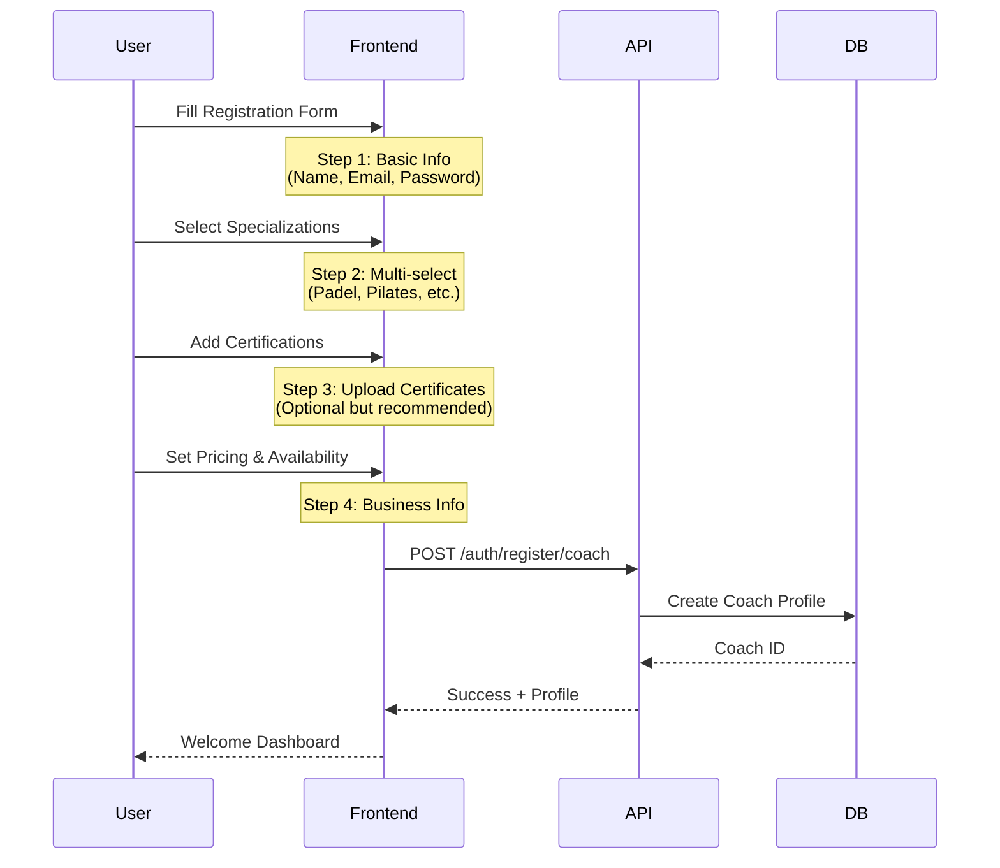
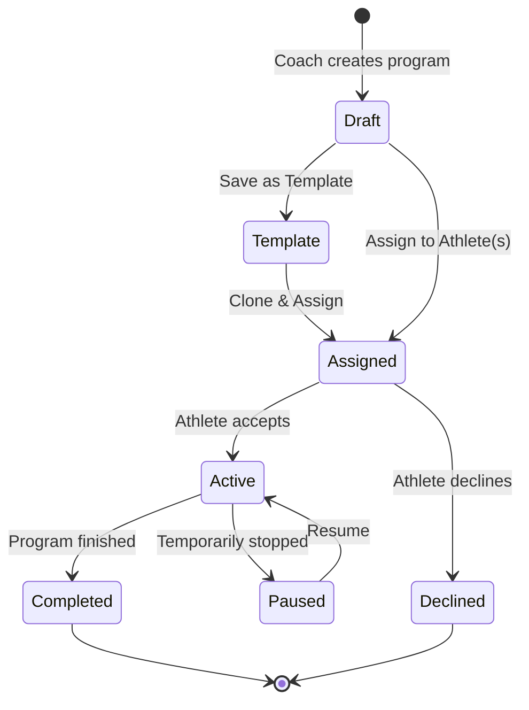
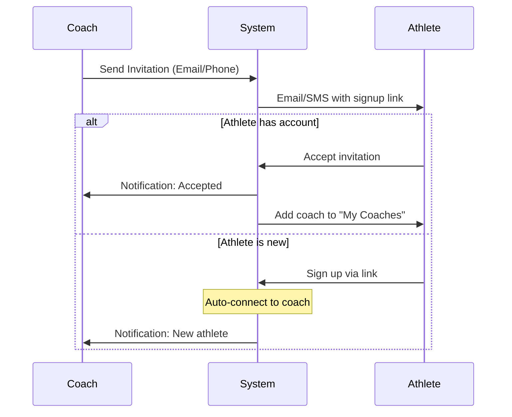
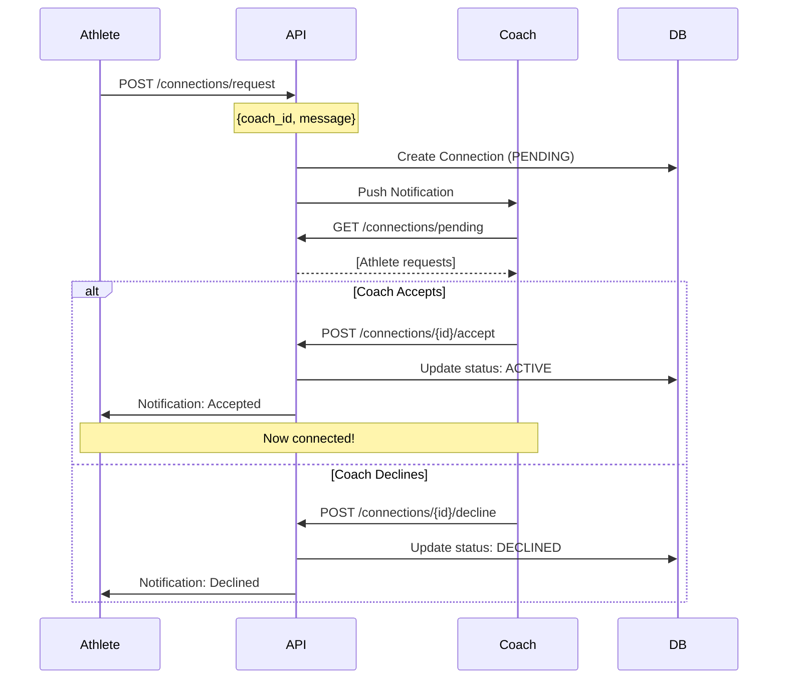

# Coach Specialization & Athlete Connection System

## 1. Coach Specializations

### 1.1 Sport Categories
Coaches specialize in specific sports/disciplines:

```typescript
enum CoachSpecialization {
  MUSCULATION = 'musculation',
  PADEL = 'padel',
  PILATES = 'pilates',
  YOGA = 'yoga',
  CROSSFIT = 'crossfit',
  BOXING = 'boxing',
  RUNNING = 'running',
  SWIMMING = 'swimming',
  CYCLING = 'cycling',
  FUNCTIONAL_TRAINING = 'functional_training',
  REHABILITATION = 'rehabilitation',
  NUTRITION_COACHING = 'nutrition_coaching'
}
```

### 1.2 Enhanced Coach Registration Flow



### 1.3 Coach Profile Schema

```typescript
interface CoachProfile extends Profile {
  type: 'COACH';
  specializations: CoachSpecialization[]; // Multiple allowed
  certifications: Certification[];
  pricing: {
    sessionPrice: number;
    currency: string;
    packageDeals?: PackageDeal[];
  };
  availability: {
    timezone: string;
    schedule: WeeklySchedule;
  };
  bio: string;
  experience_years: number;
  rating: number; // 0-5
  total_clients: number;
  verified: boolean; // Platform verification
}

interface Certification {
  id: string;
  name: string;
  issuer: string;
  date_obtained: Date;
  document_url?: string;
}
```

---

## 2. Program Creation & Assignment System

### 2.1 Program Creation Flow



### 2.2 Program Types

```typescript
interface WorkoutProgram {
  id: string;
  coach_id: string;
  title: string;
  description: string;
  specialization: CoachSpecialization; // Must match coach's specialization
  
  // Program structure
  duration_weeks: number;
  sessions_per_week: number;
  difficulty: 'beginner' | 'intermediate' | 'advanced';
  
  // Assignment status
  status: 'draft' | 'template' | 'assigned' | 'active';
  is_template: boolean; // Can be reused
  
  // If assigned
  assigned_to?: string[]; // Array of athlete IDs
  assignment_date?: Date;
  
  // Content
  weeks: ProgramWeek[];
  
  created_at: Date;
  updated_at: Date;
}
```

### 2.3 Program Assignment Options

**Option A: Immediate Assignment**
- Coach creates program → Immediately assigns to specific athlete(s)
- Athlete receives notification
- Program shows in athlete's dashboard

**Option B: Template Library**
- Coach creates program → Saves as template
- Stored in coach's personal library
- Can be cloned and assigned later to any athlete
- Allows bulk assignment to multiple athletes

**Option C: Marketplace (Future)**
- Coach publishes template to platform marketplace
- Athletes can browse and request programs
- Monetization opportunity

---

## 3. Athlete-Coach Discovery & Connection System

### 3.1 Discovery Mechanisms

#### 3.1.1 Coach Marketplace/Directory

```typescript
interface CoachSearchFilters {
  specializations?: CoachSpecialization[];
  location?: {
    city: string;
    radius_km: number;
  };
  price_range?: {
    min: number;
    max: number;
  };
  rating_min?: number;
  availability?: {
    days: string[];
    time_slots: string[];
  };
  verified_only?: boolean;
}
```

**UI Flow:**
1. Athlete navigates to "Find a Coach"
2. Filters by sport (Padel, Pilates, etc.)
3. Views coach profiles with:
   - Specializations badges
   - Rating & reviews
   - Price per session
   - Sample programs
   - Availability calendar
4. Clicks "Request Connection"

#### 3.1.2 Invitation System (Coach-Initiated)



#### 3.1.3 QR Code / Referral Link

```typescript
interface CoachReferral {
  coach_id: string;
  referral_code: string; // e.g., "COACH_AHMED_PADEL"
  qr_code_url: string;
  landing_page_url: string; // Custom page with coach info
  uses: number;
  max_uses?: number;
}
```

**Use Case:**
- Coach displays QR code in gym
- Athlete scans → Directed to coach's profile
- One-click "Train with this coach"

### 3.2 Connection Request Flow



### 3.3 Connection Types & Permissions

```typescript
interface Connection {
  id: string;
  athlete_profile_id: string;
  coach_profile_id: string;
  
  status: 'pending' | 'active' | 'paused' | 'terminated';
  
  // Permissions (athlete grants to coach)
  permissions: {
    view_workouts: boolean;
    create_programs: boolean;
    view_nutrition: boolean;
    view_medical: boolean; // Requires explicit consent
    send_messages: boolean;
  };
  
  // Business terms
  pricing_plan?: {
    type: 'per_session' | 'monthly' | 'package';
    amount: number;
    currency: string;
  };
  
  started_at: Date;
  ends_at?: Date; // For fixed-term contracts
}
```

---

## 4. Updated Database Schema

```sql
-- Coach Specializations (Many-to-Many)
CREATE TABLE coach_specializations (
    coach_profile_id UUID REFERENCES profiles(id),
    specialization VARCHAR(50) NOT NULL,
    is_primary BOOLEAN DEFAULT false,
    created_at TIMESTAMP DEFAULT NOW(),
    PRIMARY KEY (coach_profile_id, specialization)
);

-- Coach Certifications
CREATE TABLE coach_certifications (
    id UUID PRIMARY KEY DEFAULT gen_random_uuid(),
    coach_profile_id UUID REFERENCES profiles(id),
    name VARCHAR(255) NOT NULL,
    issuer VARCHAR(255),
    date_obtained DATE,
    document_url TEXT,
    verified BOOLEAN DEFAULT false,
    created_at TIMESTAMP DEFAULT NOW()
);

-- Programs (Enhanced)
CREATE TABLE workout_programs (
    id UUID PRIMARY KEY DEFAULT gen_random_uuid(),
    coach_profile_id UUID REFERENCES profiles(id),
    title VARCHAR(255) NOT NULL,
    description TEXT,
    specialization VARCHAR(50) NOT NULL,
    
    duration_weeks INTEGER NOT NULL,
    sessions_per_week INTEGER,
    difficulty VARCHAR(20),
    
    status VARCHAR(20) DEFAULT 'draft',
    is_template BOOLEAN DEFAULT false,
    
    created_at TIMESTAMP DEFAULT NOW(),
    updated_at TIMESTAMP DEFAULT NOW()
);

-- Program Assignments
CREATE TABLE program_assignments (
    id UUID PRIMARY KEY DEFAULT gen_random_uuid(),
    program_id UUID REFERENCES workout_programs(id),
    athlete_profile_id UUID REFERENCES profiles(id),
    
    status VARCHAR(20) DEFAULT 'assigned',
    assigned_at TIMESTAMP DEFAULT NOW(),
    started_at TIMESTAMP,
    completed_at TIMESTAMP,
    
    progress_percentage DECIMAL(5,2) DEFAULT 0,
    
    UNIQUE(program_id, athlete_profile_id)
);

-- Coach Referrals
CREATE TABLE coach_referrals (
    id UUID PRIMARY KEY DEFAULT gen_random_uuid(),
    coach_profile_id UUID REFERENCES profiles(id),
    referral_code VARCHAR(50) UNIQUE NOT NULL,
    qr_code_url TEXT,
    uses INTEGER DEFAULT 0,
    max_uses INTEGER,
    created_at TIMESTAMP DEFAULT NOW()
);
```

---

## 5. API Endpoints

```typescript
// Coach Registration
POST /auth/register/coach
Body: {
  email, password, name,
  specializations: string[],
  certifications?: Certification[],
  pricing: {...}
}

// Program Management
POST /programs                    // Create program
GET /programs                     // List coach's programs
GET /programs/templates           // List templates only
POST /programs/{id}/assign        // Assign to athlete(s)
POST /programs/{id}/clone         // Clone template

// Discovery
GET /coaches/search               // Search with filters
GET /coaches/{id}/profile         // Public profile
GET /coaches/{id}/programs        // Sample programs

// Connections
POST /connections/request         // Athlete requests
GET /connections/pending          // Coach views requests
POST /connections/{id}/accept     // Coach accepts
POST /connections/{id}/decline    // Coach declines
GET /connections/my-coaches       // Athlete's coaches
```

---

## 6. UI Components Needed

### For Coaches:
1. **Specialization Selector** (Multi-select with icons)
2. **Program Builder** (Drag-and-drop weeks/sessions)
3. **Template Library** (Grid view with filters)
4. **Assignment Modal** (Select athletes, set dates)
5. **Connection Requests** (Inbox-style list)

### For Athletes:
1. **Coach Discovery** (Card grid with filters)
2. **Coach Profile View** (Detailed info + reviews)
3. **Connection Request Form** (Message + preferences)
4. **My Coaches** (List with quick actions)
5. **Program Acceptance** (Preview + Accept/Decline)

---

## 7. Next Steps for Implementation

1. ✅ Update `Profile` schema to include specializations
2. ✅ Create registration flow with specialization selection
3. ✅ Build program creation UI with template option
4. ✅ Implement coach discovery/search page
5. ✅ Create connection request system
6. ✅ Add program assignment workflow
