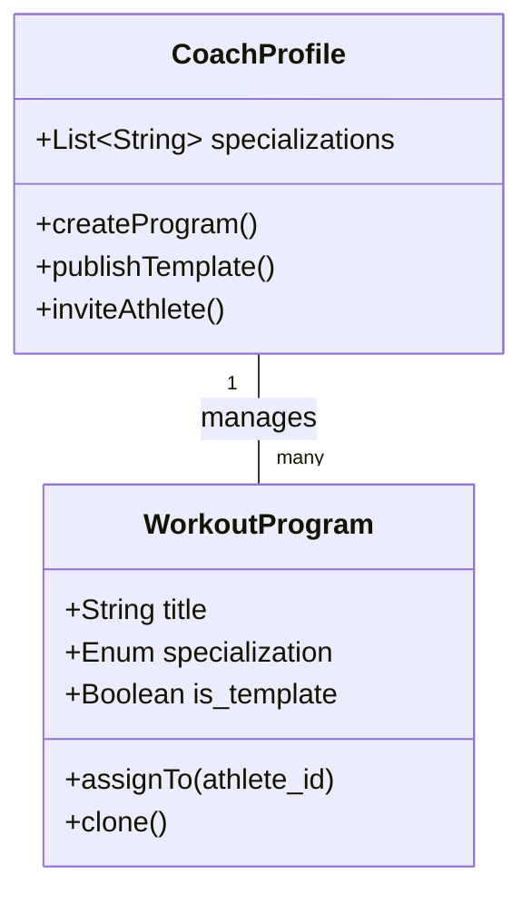

# Tunisia Health & Fitness Ecosystem - Deep Conception

**Status**: LIVE DESIGN
**Goal**: Define the "Rules of the Game" for the Coaching Platform.

## 1. The "Ecosystem" Logic

We are building a **Permission-Based Network** connecting Clients, Coaches, Nutritionists, Doctors, and Gyms.

### 1.1 The Actor Matrix (Access Control)

| Data Type | Owner (Client) | Coach | Nutritionist | Doctor | Gym Manager |
| :--- | :--- | :--- | :--- | :--- | :--- |
| **Profile** (Name, Age) | **Edit** | Read | Read | Read | Read |
| **Workout Logs** | **Edit** | **Create/Edit** | Read (if allowed) | Read (Summary) | No Access |
| **Meal Logs** | **Edit** | Read (if allowed) | **Create/Edit** | Read (Summary) | No Access |
| **Medical History** | **Edit** | ⚠️ Limited (Injuries) | ⚠️ Limited (Allergies) | **Full Access** | No Access |

---

## 2. Coach Specialization & Discovery (NEW)

### 2.1 Specialization Logic
Coaches are not generic. They must select **Specializations** during onboarding:
*   **Categories**: Padel, Pilates, Musculation, Yoga, CrossFit, Boxing, etc.
*   **Verification**: Coaches upload certifications for each specialization.

### 2.2 The "Connection" Marketplace
Athletes find coaches via:
1.  **Marketplace Search**: Filter by *Specialization*, *Location*, *Price*, *Rating*.
2.  **Direct Invite**: Coach sends a link (email/SMS).
3.  **QR Code**: Scan a poster in a partner gym.

**Connection Flow**:
`Athlete Requests` -> `Coach Accepts` -> `Contract Active` -> `Permissions Granted`.

---

## 3. Data Architecture (The Graph)

### 3.1 ERD (Entity Relationship Diagram)

```mermaid
erDiagram
    %% Core Identity
    USER { uuid id, string email, string password_hash }

    %% Specialized Profiles
    PROFILE {
        uuid id, uuid user_id, enum type, string display_name
        jsonb specialized_data "{specialty: ['PADEL', 'PILATES']}"
    }
    
    USER ||--|{ PROFILE : owns

    %% The Network Connection
    CONNECTION {
        uuid id, uuid initiator_id, uuid receiver_id
        enum status "PENDING, ACTIVE, DECLINED"
        jsonb permissions "{view_medical: false}"
    }
    
    PROFILE ||--o{ CONNECTION : links

    %% Domain Data
    WORKOUT_PROGRAM {
        uuid id, uuid coach_id, string title
        enum specialization "PADEL"
        boolean is_template
    }
    
    WORKOUT_ASSIGNMENT {
        uuid program_id, uuid athlete_id
        date assigned_at
    }

    PROFILE ||--o{ WORKOUT_PROGRAM : creates
    WORKOUT_PROGRAM ||--o{ WORKOUT_ASSIGNMENT : assigned_to
```

### 3.2 Domain Class Logic (Programs)



---

## 4. Use Cases (User Experience)

```mermaid
useCaseDiagram
    actor "Athlete" as Athlete
    actor "Coach (Specialist)" as Coach

    package "Discovery" {
        usecase "Search by Sport (Padel/Pilates)" as UC_Search
        usecase "Scan QR Code" as UC_Scan
    }

    package "Coaching" {
        usecase "Create Program Template" as UC_Template
        usecase "Assign Program to Athlete" as UC_Assign
        usecase "Log Session" as UC_Log
    }

    Athlete --> UC_Search
    Athlete --> UC_Scan
    Athlete --> UC_Log
    
    Coach --> UC_Template
    Coach --> UC_Assign
```

## 5. Next Specifications Needed
1.  **Onboarding Flow**: Coach Registration Wizard screens.
2.  **Marketplace UI**: Filters and Coach Cards.
